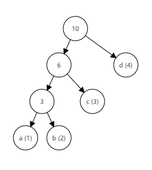
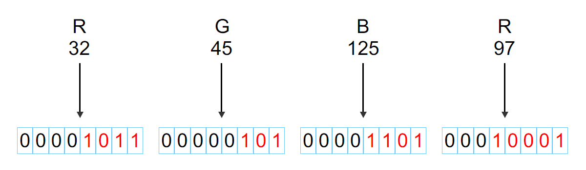
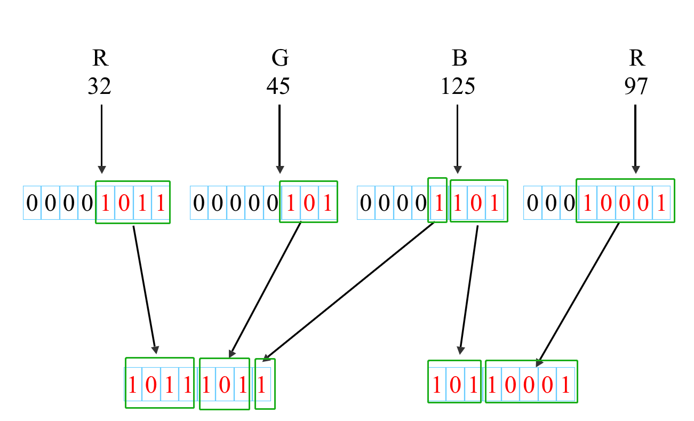

------------------------------

COMP7503 Multimedia Technologies

Programming Assignment

Group Members: Hanke Wang, Jiaxing Zeng

-----------------------------


# Quantize565 & Dequantize565

## Brief Introduction

In quantize565 and dequantize565 part, we learn the the idea in the given example quantize555 and dequantize555. We find that we only need to change the shifting bit to complete this function.

## Quantize565

The differences between Quantize565 and Quantize555 are only the shift digits of green color and the storage.  

Red color is stored in the first 5 bits in rgb16, so it is right shifted 11 bits.

Green color is given 6 bits to store, so it just need to left shift 2 bits.

```c
rgb16 = ((r >> 3) << 11) | ((g >> 2) << 5) | (b >> 3);
```

## Dequantize565

In Dequantize565, we do the inverse process of Quantize565. 

```CQL
r = (rgb16 >> 11) & 0x1F;
g = (rgb16 >> 5) & 0x3F;

unquantizedImageData[(i + j * width) * 3 + 1] = (g << 2); //For green color
```


# Compress & Decompress

## Brief Introduction

In the compression & decompression part, we use **Huffman Coding** as our compression algorithm.

- There are 4 steps to compress the image:

    1. A *Huffman Tree* will be built according to the **appearance frequency** of pixels bits.

    2. The *Huffman Tree* will be converted to a **Huffman Coding Mapping Table**.

    3. All the pixels of the input image will be encoded on the basis of the **mapping table**.
    4. The mapping table and the encoded string will be written to variable **compressedData**.
- There are 4 steps to decompress the image:
    1. Recover the **Huffman Coding Mapping Table** from the encoded string (variable **compressedData**).
    2. Rebuild the *Huffman Tree* from the **mapping table**.
    3. Scan the encoded string bit by bit to recover the pixels according the *Huffman Tree*.
    4. Recovered pixels will be written to variable **uncompressedData** .


## Compress

### 1. Variable Initialization

In the beginning, we create a new ``unsigned char[]`` with size 1024. Because we won't know the compressed size until we encoded everything, so we simply create a suitable size and then enlarge it when we need.

```cpp
// Initialize variable compressedData
int size_compressed_data = 1024;
unsigned char *compressedData = new unsigned char[size_compressed_data];
memset(compressedData, 0, sizeof(unsigned char) * size_compressed_data);
```


Each time we write data to **compressedData**, we will check whether the size is enough. Otherwise we will create a new ``unsigned char*`` with **110%** size of the previous size and copy the previous data to it.

The reason why we choose **110%** is that if we use **200%** instead, the size may be too large at the end which may left too much leisure by waste memory.

```cpp
/* Automatically adjust size of unsigned char* */
void writeData(unsigned char* &target, int& size, int pos, unsigned char data) {
	if (pos + 1 > size) {
		int adjustedSize = int(size * 1.1);
		unsigned char* base = new unsigned char[adjustedSize];
		memcpy(base, target, size);
		delete[] target;
		size = adjustedSize;
		target = base;
	}
	target[pos] = data;
}
```


Next, we will construct a mapping table to store the *Huffman Tree*. We allocate ``unsigned char[]`` with size  **256 * 32**.

```cpp
/* Huffman Code Mapping Table */
unsigned char* huffmanTree = new unsigned char[256 * 32];
memset(huffmanTree, 0, sizeof(unsigned char) * 256 * 32);
```

We will encoding the 'R' or 'G' or 'B' of the pixel which is stored using 8 bit previously, which means it can have maximum 256 kinds of situation.

Considering the worst situation that the *Huffman Tree* is extremely unbalanced(Figure below). There will be **256** leaf nodes of *Huffman code* when 0 ~ 255 all appear in the pixels RGB bits. Consequently the depth of the tree will be maximum **255**, which means we have to use at least **255** bits to store the *Huffman Code*.



To manipulate it simply, we complement it to **256** bits so we decide to use ``unsigned char[32]`` to store each *Huffman Code*. In order to store 256 kinds of *Huffman Code*, we allocate a `unsigned char[256 * 32]`.


In the meantime, we will also store the length of each *Huffman Code*. 

```cpp
/* Encoding length of Huffman Code */
int *encoding_len = new int[256];
memset(encoding_len, 0, sizeof(int) * 256);
```

Considering the following situation:

```python
32 : 01
48 : 001
```

The *Huffman Code* of 32 is "01" while 48 is "001". The value of them are equal but the number of bits are different, thus we need to record the length of each *Huffman Code*.


### 2. Huffman Tree Building

After initialization, we use input picture data to build a *Huffman tree* to get *Huffman code* for each number appeared. 

#### Define *Huffman tree* node and data preparation

First of all, we define the node for Huffman tree:

```c++
struct treeNode {
	int key;
	int value;
	treeNode* parent;
	treeNode* leftChild;
	treeNode* rightChild;
};
```

In this struct, **key** means the color, for each red,  green or blue color, the number for key is always 0~255. **Value** stores the number of each color appeared. **Parent**, **leftChild** and **rightChild** store the parent node, left child node and right child node respectively. 

We create **512** tree node to store all nodes in *Huffman tree*, including leaf nodes, branch nodes and root node.  Actually, 511 is the max number of nodes needed for this *Huffman tree*.

After that, we initialization all tree node and another array named `colorValueShown[256]` to store the number of each color appeared.  

We scan the input picture, calculate the number of each color appeared.

```c
for (int i = 0; i < cDataSize; i++) {
	unsigned char colorValue = pInput[i];
	int iColorValue = (unsigned int)colorValue;
    colorValueShown[iColorValue]++;
}
```

#### Build *Huffman tree*

Now that we have all numbers of color appeared,  we can build the *Huffman tree* for this particular picture.

Building a tree is an **loop process**. In each loop, we find the **two nodes** which are not used and whose values are **smallest**. We set a new node as their parent node. The value of the new node is the **sum** of those two nodes, and its children nodes are those two nodes.

```c
//leafNum: the numbew of color value, max is 256;
//if the number of leafNum is x, the number of branch node and root node are x-1;
//so we just need x-1 loop.
for (int i = leafNum; i < 2 * leafNum - 1; i++) {
	buildHuffmanTree(node, i);
}
```

```c
void buildHuffmanTree(treeNode** node, int n) {
	int i1 = 0; int i2 = 0;

    //find the smallest two node and store the node subscript in i1 and i2.
	select(node, &i1, &i2, n); 

	node[i1]->parent = node[n];
	node[i2]->parent = node[n];
	node[n]->leftChild = node[i1];
	node[n]->rightChild = node[i2];
	node[n]->value = node[i1]->value + node[i2]->value;
}
```

#### Code each color in *Huffman code*

After building the *huffman tree*, we can code for each color value in the picture.

There are two important values: 

> code for each color, e.g. 124 &rArr; 0010110
>
> code length for each color, e.g. 124 &rArr; 7

We use a ``unsigned char[32]`` to store the code in case of the worst case, and a int to store the length.

For each color, we code it from the **leaf nodes**. In each step, we make these judgements . 

> If the node does not have parent node, that means it's the root node, and we stop coding.
>
> If the node still have parent node,
>
> > if this node is its parend node's left child, we add a bit **1**,
> >
> > else, we add a bit **0**.

```c
//For a particular color i:
treeNode* parentNode = node[i]->parent;
treeNode* childNode = node[i];
while (childNode->parent != NULL) {
	if (childNode == parentNode->leftChild) {
        //numParent: how many parents do the node have until this loop, we code the bit.
        //Set the bit to 1 
		unsigned char temp = code[31 - numParent / 8] | (0x1 << (numParent % 8));
		code[31 - numParent / 8] = temp;
    }
	numParent++; 
	childNode = childNode->parent;
	parentNode = childNode->parent;
}
```

Here we get the code of a particular color i, and the length is acutally how many parents do the node have, that is the variate `numParent`.

We put the `color value`, `code` and `length` into two arrays, and pass it to the next step to encode.


### 3. Encoding Pixel

After Building the *Huffman Tree* and converting it to the *Mapping Table*, we can know the **maximum length** of all *Huffman Code*.

Thus, we can no longer use ``unsigned char[32]`` to store a *Huffman Code*. We will use the complemented maximum length of *Huffman Code* as the size.

```cpp
/**
 * Calculate the length that complement binary bit
 * examples:
 *       5 ->  8
 *       9 -> 16
 *      17 -> 32
 */
int calcComplementLength(int len) {
	int n = 0;
	while (++n <= 32) {
		if (len < n * 8) return n * 8;
	}
	return 256;
}
```

So we can adjust the size of the *Huffman Code* to smallest when we encoding the pixels.

```cpp
/* Suppose the maximum size of Huffman Code is 13
 * We will only need 16 bit to store it.
 * So we only need to allocate "unsigned char[2]" for each Huffman Code.
 */ 
int encoding_len_max = 13;
encoding_len_max = calcComplement(encoding_len_max); // 16
int byte_encoding_len_max = encoding_len_max / 8; // 2
unsigned char* encoded = unsigned char[byte_encoding_len_max];
```


Next, we will transform the pixel **RGB** to an **encoded sequence** according to the *Huffman Code Mapping Table*.

```cpp
// Create Encoded Sequence
unsigned char *encodedSequence = new unsigned char[cDataSize * byte_encoding_max];
memset(encodedSequence, 0, sizeof(unsigned char) * cDataSize * byte_encoding_max);
// Length of each Encoded bits
unsigned int *encodedLength = new unsigned int[cDataSize * byte_encoding_max];
memset(encodedLength, 0, sizeof(unsigned int) * cDataSize * byte_encoding_max);
```



```cpp
// pmy => primary, means one of the three-primary-color, like one of the (R, G, B)
for (int pmy = 0; pmy < cDataSize; ++pmy) {
    // Empty chars
    memset(encoded, 0, sizeof(unsigned char) * byte_encoding_max);
    // Get mapped Huffman Code
    for (int i = 0; i < 32; ++i) {
        huffmanCode[i] = huffmanTree[(pInput[pmy] * 32) + i] & 0xFF;
    }

    // Get mapped Huffman Code Length
    int len = encoding_len[pInput[pmy]];
    // Copy Huffman Code to Encoded Sequence for certain bits, from back to front 
    for (int i = 31, j = byte_encoding_max; len > 0 && i >= 0 && j >= 0; --i) {
        unsigned int l = len > 8 ? 8 : len;
        len -= l;
        encoded[--j] = huffmanCode[i] & ((1 << l) - 1);
        // Save the encoded bits
        encodedSequence[pmy * byte_encoding_max + j] = encoded[j];
        // Save the length of encoded bits
        encodedLength[pmy * byte_encoding_max + j] = l;
    }
}

```


### 4. Write Data

In the beginning, we need to write the Huffman Code Mapping Table to **CompressedData**.

```cpp
/* Package the Huffman Table into @var{compressedData} */
unsigned int tableSize = 0;
for (unsigned int i = 0; i < 256; ++i) {
    if (encoding_len[i] != 0) { // Ignore the pixel that not appear
        ++tableSize;             // calculate the table size
        // Put the key of Huffman Table
        writeData(compressedData, size_compressed_data, ++pos_data, (unsigned char)i);
        // Put the value of Huffman Table
        for (int j = 32 - byte_encoding_max; j < 32; ++j) {
            writeData(
                compressedData,
                size_compressed_data,
                ++pos_data,
                huffmanTree[i * 32 + j] & 0xFF
            );
        }
        // Put the encoding len of each Huffman code
        writeData(
            compressedData,
            size_compressed_data,
            ++pos_data,
            (unsigned char)encoding_len[i]
        );
    }
}

```

In addition, we will store the **size** of *Huffman Code Mapping Table* and the **maximum size** of *Huffman Code* to the first two byte of **compressedData**.

```cpp
/**
 * Store the size of Huffman Table
 * &
 * bytes of max encoding len of Huffman Table
 * at the head @var{compressedData}
 */
compressedData[0] = (unsigned char)tableSize;
compressedData[1] = (unsigned char)byte_encoding_max;
```


Finally, we will write the encoded sequence to **compressedData**.

Due to the that we can only manipulate a char(8 bit) at a time, we need to split the bits to into groups which each consist of 8 bits.

To achieve that, we use an unsigned char as a **buffer**. Then, we write the encoded sequence to the **buffer** bit by bit. Each time the **buffer** is **fully filled**, we will write the buffer to the **compressedData**.



After all above operations completed, we modify the **cDataSize** and return the **compressedData**.


## Decompress

### 1. Recover Huffman Tree Mapping Table

Firstly, we will recover the **size** of *Huffman Table* and the **maximum size** of *Huffman Code* from **compressedData**.

```cpp
// Huffman Tree Table Size
int treeSize = compressedData[++pos_data] & 0xFF;
/* 
 * Since The table size will range from 1 to 256
 * We use 0 to denote 256
 */
if (treeSize == 0) treeSize = 256;
// Maximun Length of Encoding
int byte_encoding_max = compressedData[++pos_data] & 0xFF;
```

Then, we recover the *Huffman Tree Mapping Table*.

```cpp
unsigned char* huffmanTree = new unsigned char[256 * 32];
memset(huffmanTree, 0, sizeof(unsigned char) * 256 * 32);
int *encoding_len = new int[256];
memset(encoding_len, 0, sizeof(unsigned int) * 256);
for (int i = 0; i < treeSize && pos_data < cDataSize; ++i) {
    // Recover the key of Huffman Table
    unsigned int key = compressedData[++pos_data] & 0xFF;
    // Recover the value of Huffman Table
    for (int j = 32 - byte_encoding_max; j < 32; ++j) {
        huffmanTree[key * 32 + j] = (compressedData[++pos_data] & 0xFF);
    }
    // Recover the encoding length of Huffman Table
    encoding_len[key] = (int)(compressedData[++pos_data] & 0xFF);
}
```


### 2. Rebuild Huffman Tree

After knowing the *Huffman Tree Mapping Table* and *length array*, we rebuild *Huffman tree* for further decompress.

For each color, we build the tree from the root node.

> for every bit in the code of a particular color, 
>
> if the bit is 1, we move to the current node's left child;
>
> > if the node does not have left child, we build a new left child;
>
> if the bit is 0, we move to the current node's right child;
>
> > if the node does not have right child, we build a new right child;

```c
treeNode* currentNode = rootNode;
//for each color value
for (int i = 0; i < 256; i++) {
    //get the code length of this color
	if (lens[i] != 0) {
		int len = lens[i];
        //loop for every bit in the code of the color, find a way to go to leaf node. 
		for (int j = 32 * 8 - len; j < 32 * 8; j++) {
			if (((dict[32 * i + j / 8] >> (7 - j % 8)) & (0b1)) == (0b1)) {
				if (currentNode->leftChild == NULL) {
                    //create a new node for left child
					currentNode->leftChild = nodes[currentNum + 1];
					currentNum = currentNum + 1;
				}
				currentNode = currentNode->leftChild;
			}
			else {
				if (currentNode->rightChild == NULL) {
                    //create a new node fot right chlid
					currentNode->rightChild = nodes[currentNum + 1];
					currentNum = currentNum + 1;
				}
				currentNode = currentNode->rightChild;
			}
		}
        //the key of this leaf node is the color value.
		currentNode->key = i;
        //for nexr loop, set the current node return to the root node.
		currentNode = rootNode;
	}
}
```

Finally, we get the root node and the whole rebuilt *Huffman tree*. 


### 3. Scan encoded string and recover pixels

Due to the that we can only manipulate a char(8 bit) at a time, we use an unsigned char as a buffer to read 8 bit at a time.

Then we traverse the *Huffman Tree* node by node according the data bit by bit.

```cpp
unsigned char buf = compressedData[++pos_data] & 0xFF;
unsigned int pos_buf = 0;
while (pos_data < cDataSize) {
    treeNode* node = rootNode;
    while (1) {
        // Buffer end, read new data
        if (pos_buf > 7) {
            buf = compressedData[++pos_data] & 0xFF;
            pos_buf = 0;
        }
        if (((buf >> (7 - pos_buf)) & 0b1) == 1) {
            if (node->leftChild != nullptr) {
                node = node->leftChild;
            } else {
                // Find a value
                break;
            }
        }
        else {
            if (node->rightChild != nullptr) {
                node = node->rightChild;
            } else {
                // Find a value
                break;
            }
        }
        ++pos_buf;
    }
    // Write to uncompressedData
    uncompressedData[pos_uncompressed_data++] = node->key & 0xFF;
}
```

Each time we find a value in the tree, we write the value to **uncompresedData** simultaneously.

Finally, we finished decompressing the image.


# Experiment

## Procedure

### Beach


| Type             | Compression Ratio |
| ---------------- | ----------------- |
| Before Quantized | 1.04              |
| After Quantized  | 1.71              |


### Red Panda


| Type             | Compression Ratio |
| ---------------- | ----------------- |
| Before Quantized | 1.02              |
| After Quantized  | 1.65              |


### sunset


| Type             | Compression Ratio |
| ---------------- | ----------------- |
| Before Quantized | 1.03              |
| After Quantized  | 1.67              |


### Tuxinu


| Type             | Compression Ratio |
| ---------------- | ----------------- |
| Before Quantized | 1.52              |
| After Quantized  | 2.25              |

### Hydrogen (Custom Image)


| Type             | Compression Ratio |
| ---------------- | ----------------- |
| Before Quantized | 5.65              |
| After Quantized  | 5.65              |

## Explaination

According to the result above, we can find that there is obvious improvement of the **Compresssion Ratio** in each picture from **8-8-8 original** picture to **5-5-5 quantized** picture. 

The main reason for the improvement is that, when we do differential coding, we only focus on the difference between two values. As the step of difference value of three-primary colors of RGB between two adjacent pixels in the **5-5-5 quantized** picture is much more bigger than **8-8-8 original** picture. for example,  the *Red* color value of three adjacent pixels is ` 01001100`, `01001000` and `01001010`. In **original** picture the differential value is ` 4` and `-2`, but in **quantized** picture the differential value is `0` and `0`. Normally, all the difference in the last 3 bits of **8-8-8 original** picture will be quantized. So, the number of different values in **5-5-5 quantized** picture is much more less than that in **8-8-8 original** picture. 

When we using *Huffman coding* to compress the differential coding value, the average length of code mainly depends on the number of different values. As we have discussed above, the number of different values in **5-5-5 quantized** picture is much more less than that in **8-8-8 original** picture. So, the average length of *Huffman code* in **quantized** picture is much more shorter than that in **original** picture. That is the reason for the improvement of **Compression Ratio**.

